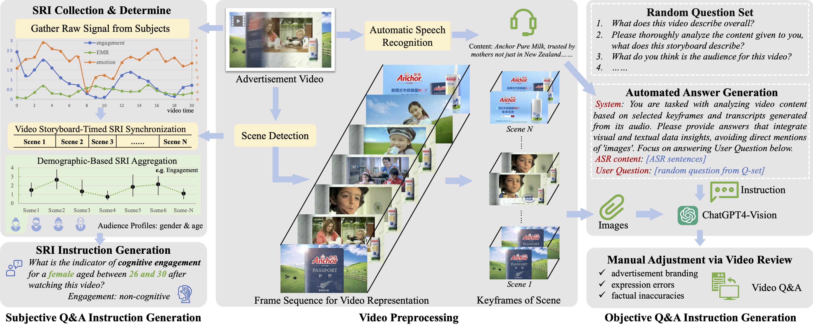
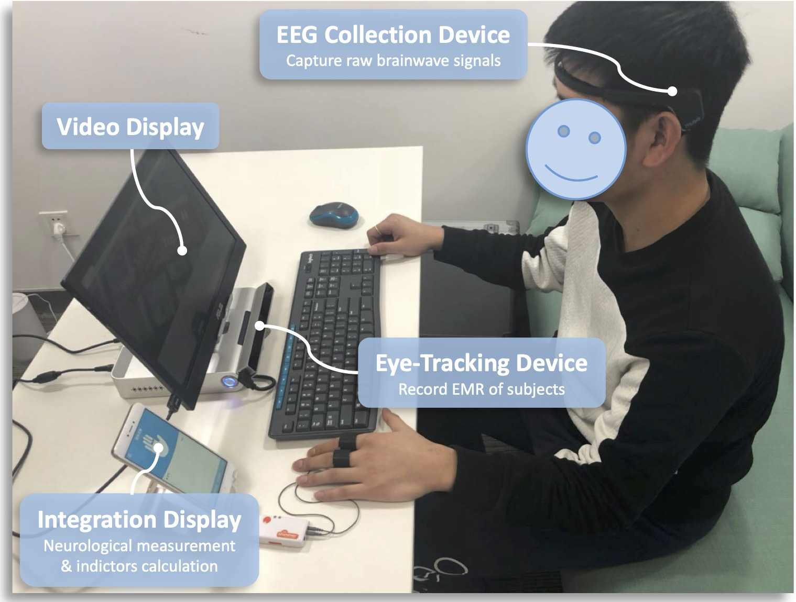

# HMLLM 
<h5 align="center">

</h5>

## Subjective Response Indicators for Advertisement Videos Dataset (SRI-ADV)
The SRI-ADV dataset collects brainwave and eye movement responses from individuals of various ages, genders, and professions while watching advertisement videos, using advanced EEG and eye-tracking technologies. It focuses on revealing viewers' subjective reactions to advertisement videos. This dataset not only provides a wealth of multimodal labels but also introduces new ways to assess video attractiveness and understand viewers' implicit reactions.

### 🎯 Dataset Features
The SRI-ADV dataset includes **498 Chinese advertisement videos** from different fields, such as food and beverages, household items, consumer electronics, culture and tourism, software, and automobiles, with video durations of **15-30 seconds**. Compared to other datasets, the video content of the SRI-ADV dataset is rich in narrative, unique in visual aesthetics, and deep in audience insight.

### 📊 Data Protocol
The SRI-ADV dataset is divided into subjective and objective tasks. Subjective tasks focus on **examining audience subjective reactions**, while objective tasks focus on the qualitative analysis of **video content and audience perception**.

#### 1. Subjective Tasks
These tasks aim to explore the impact of video content and user characteristics on SRI through classification tasks. We developed two experimental protocols to guide this research.
* **Protocol 1 (P1)**: Aimed at assessing the SRI capability of a broad audience by analyzing the average reaction in different videos. This method is relatively direct.
* **Protocol 2 (P2)**: Adds a layer of complexity based on P1, focusing on the SRI recognition ability of specific user groups. This requires a comprehensive examination of the variation in reaction patterns among different user groups.

#### 2. Objective Tasks
These tasks aim to objectively determine the narrative coherence of advertisement content and its effectiveness in attracting the target audience. In terms of evaluation, it follows the evaluation paradigm in [Video-ChatGPT](https://github.com/mbzuai-oryx/Video-ChatGPT/tree/main/quantitative_evaluation) to score the accuracy of generated answers.

#### 3. Overview of Tasks and Protocols
The table below presents an overview of the tasks, protocols, and the number of instructions in the SRI-ADV dataset.

| Task Name | 1. Subjectivity | 2. Objectivity |
| --- | --- | --- |
| Evaluation Form | Multi-classification | Text generation |
| Train Video | 426 | 426 |
| Test Video | 72 | 72 |
| Train Q&A | 145,107 | 5762 |
| Test Protocol | P1 & P2 | - |
| Test Q&A | 2,640 & 26,724 | 954 |

### 🌏 Data Collection Process
The SRI-ADV data collection is divided into two processes: subjective index generation and objective Q&A generation. The overall collection process is illustrated as follows:

Caption of Generation pipeline of SRI-ADV dataset

The left side of this figure illustrates the process of SRI data collection, computation, and amalgamation. This involves acquiring raw signals from subjects, processing signals by video scenes, and pooling data from subjects with similar demographic profiles to obtain aggregated subjective response indicators and instruction for language models. The middle section depicts the video preprocessing with Frame Sequence for Video Representation (FSVR) by scene detection and Automatic Speech Recognition (ASR) for videos. On the right side, we present our proposed semi-automated video Q&A generation process, which leverages both video storyboarding from FSVR and dialogue text from ASR. This integration enriches video content comprehension, thereby facilitating both Subjectivity and Objectivity Tasks.

#### 1. Frame Sequence for Video Representation (FSVR)
* Purpose: To preprocess videos, extract keyframe time points and keyframes, thereby achieving temporal segmentation of video content to support the alignment of subjective indicators and semi-automatic Q&A generation.
* Process: Incorporates the AdaptiveDetector algorithm to segment advertisement videos based on the sensitivity of changes in video scenes.

#### 2. Subjective Index Generation Process
Participants collect their raw electroencephalogram (EEG) and eye movement signals using the collection device shown below.

* Purpose: To collect subjective index responses to advertisement videos from different participants.
* Collection Process: By watching advertisement videos, synchronously collecting EEG and eye-tracking data from over 4600 participants, along with anonymous demographic information.
* EEG Index Calculation: Based on EEG signals, focusing on analyzing two key indices: engagement (EN) and emotion (EM), and defining Eye Movement Ratio (EMR) through eye movement data to measure the audience's visual attention. Finally, aligning each index with the video and storyboard according to temporal information and organizing them into Q&A pairs suitable for large model learning.

#### 3. Objective Q&A Generation Process
* Purpose: To capture the objective content of advertisement videos; generate Instruction Q&A pairs for training large models.
* Semi-automated Annotation Process: Developed a semi-automated annotation process, using the ChatGPT4-Vision (GPT4V) tool, combined with keyframes obtained from FSVR preprocessing, to generate objective Q&As of video content. By randomly selecting questions from the question set to increase the diversity of Q&As, and undergoing final review and proofreading by human annotators.

### 📝 Data Examples
Data examples from SRI-ADV and the inference results of different models are shown below.

> Data examples and qualitative analysis from SRI-ADV. The left side of the image shows the ground truth; the right side shows inference results from different models, where green represents accurate descriptions, and red indicates incorrect responses.

### 📡 Dataset Comparison

Comparison

Compared to other datasets suitable for video parsing, SRI-ADV has more modalities, a longer average answer text length (99.6), and a larger median number of storyboards (11). This means each advertisement video in SRI-ADV contains a larger amount of content information, increasing the difficulty and complexity of video comprehension tasks.
> AP in the table stands for Audience Profiles.

| Datasets| Video source | Q&A generation | Q&A tasks| Modality| Videos | Q&A pairs |AvgAnsLen | MedScene |
|--------------------|--------------|----------------|--------------|-------------------|--------|-----------|-----------|----------|
| MSVD-QA | MSVD| Auto| OE| Video|1,970|50,505|1.0|2|
| MSRVTT-QA | MSRVTT| Auto| OE| Video|10,000|243,680|1.0|3|
| TGIF-QA | TGIF| Auto&Human| OE & MC| Frame/Video|56,720|103,919|1.5|1|
| ActivityNet-QA | ActivityNet| Human| OE| Video|5,800|58,000|1.3|7|
| Video-ChatGPT | ActivityNet| Auto&Human| OE| Video|200|2,994|51.0|6|
| **SRI-ADV** (ours)| Custom| Auto&Human| MC & OE| **Video/EEG/EMR/AP** |498|178,547| **99.6** | **11** |

-----
## 🧩 Network Structure
Coming soon

## 📄 Citation
Coming soon 

## 💫 Acknowledgement
We thank the following projects or papers for their assistance in this project
[PySceneDetect](https://github.com/Breakthrough/PySceneDetect), [Video-ChatGPT](https://github.com/mbzuai-oryx/Video-ChatGPT),  [VideoChat2](https://github.com/OpenGVLab/Ask-Anything)