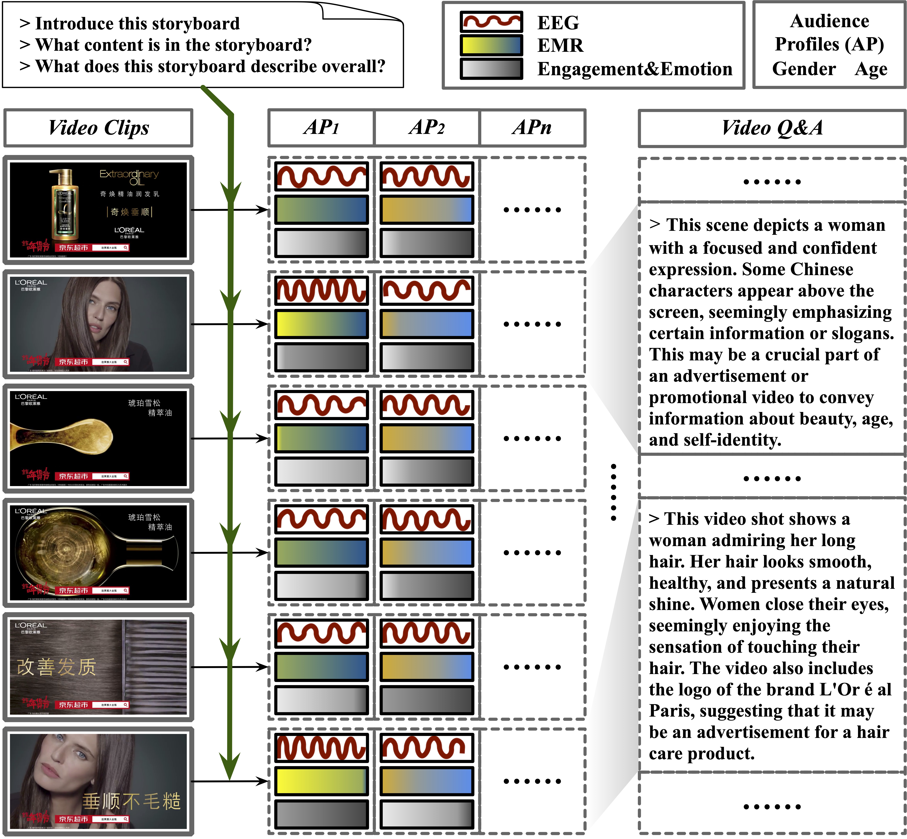
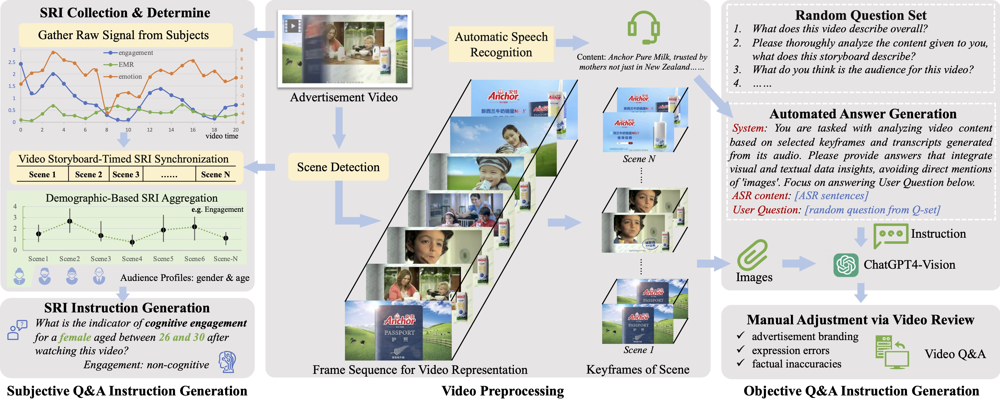
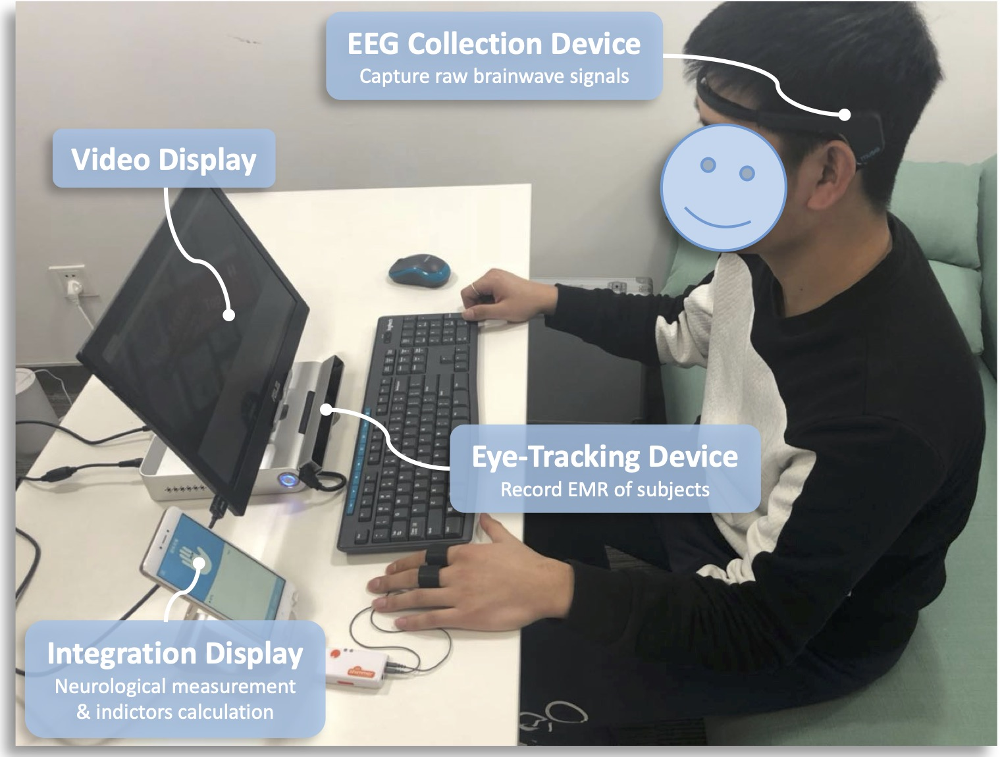
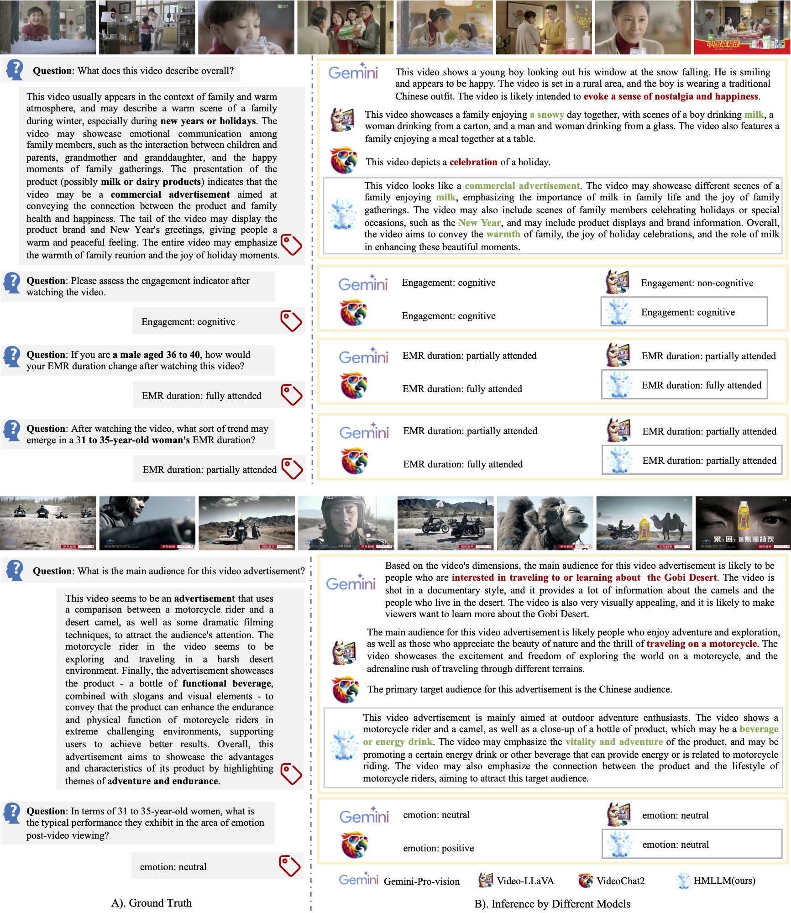

# HMLLM 
<h5 align="center">

</h5>

## 广告视频的主观反应指标数据集 Subjective Response Indicators for Advertisement Videos dataset (SRI-ADV)
SRI-ADV数据集通过高级EEG和眼动跟踪技术，收集了跨年龄、性别和职业的个体在观看广告视频时的脑电反应和眼动响应，聚焦于揭示观众对广告视频的主观反应。该数据集不仅提供了丰富的多模态标签，还引入了评估视频吸引力和理解观众隐性反应的新途径。

### 🎯 数据集特点
SRI-ADV数据集包含来自不同领域的**498个中文广告视频**，如食品饮料、家用物品、消费电子、文化旅游、软件和汽车等，视频时长**15-30秒**。与其他数据集相比，SRI-ADV数据集的视频内容具有丰富的叙事性、独特的视觉美学和深入的受众洞察。

### 📊 数据协议
SRI-ADV数据集被划分为主观性任务和客观性任务两大类。主观性任务关注于**受众主观反应的考察**，而客观性任务专注于**视频内容和受众感知**的定性分析。

#### 1. 主观性任务
此任务旨在通过分类任务的形式，探讨视频内容及用户特征对SRI的影响。我们开发了两种实验协议来指导这一研究。
* **协议1（P1）**：旨在评估广泛受众的SRI能力，分析不同视频中平均反应。这种方法相对直接。
* **协议2（P2）**：在P1的基础上，增加了一层复杂性，专注于特定用户人群的SRI辨识能力。这需要全面检查不同用户群体中反应模式的变化。

#### 2. 客观性任务
此任务旨在客观确定广告内容的叙事连贯性及其在吸引目标受众方面的有效性。评估方案上，遵循[Video-ChatGPT](https://github.com/mbzuai-oryx/Video-ChatGPT/tree/main/quantitative_evaluation)中的评估范式，对生成答案的准确性并进行打分。

#### 3. 任务与协议表格概览
下方表格展示了SRI-ADV数据集的任务、协议和instruction数量的说明。

| 任务名称 | 主观任务（1. Subjectivity） | 客观任务（2. Objectivity） |
| --- | --- | --- |
| 评估形式 | 多类分类 | 文本生成 |
| 训练视频数量 | 426 | 426 |
| 测试视频数量 | 72 | 72 |
| 训练问答数量 | 145,107 | 5762 |
| 测试协议 | P1 & P2 | - |
| 测试问答数量 | 2,640 & 26,724 | 954 |

### 🌏 采集过程
SRI-ADV数据采集分为主观指标生成与客观问答生成两个过程。其整体采集流程如图所示:

SRI-ADV数据集生成流程

该图的左侧展示了SRI数据收集、计算和合并的过程。这包括从受试者获取原始信号，通过视频场景处理信号，以及汇集具有相似人口统计特征的受试者数据，以获得汇总的主观反应指标和语言模型指令。中间部分描述了通过场景检测和视频的自动语音识别（ASR）进行视频预处理，以及视频表示的帧序列（FSVR）。在右侧，我们展示了我们提出的半自动视频问答生成过程，该过程利用了FSVR的视频分镜和ASR的对话文本。这种整合丰富了视频内容的理解，从而便于主观性和客观性任务的进行。

#### 1. 分镜策略（Frame Sequence for Video Representation, FSVR）
* 目的：进行视频预处理，提取分镜时间点与关键帧，进而实现视频内容的时序切分，以支撑主观指标的对齐和半自动化问答生成。
* 处理流程：集成AdaptiveDetector算法，根据视频场景的变化灵敏度切分广告视频。

#### 2. 主观指标生成过程
受试者使用下图所示的采集设备采集其原始的脑电波动及眼动信号。

* 目的：收集不同受试者，对广告视频的主观指标反应情况。
* 采集过程：通过观看广告视频，同步收集超过4600名参与者的脑电图（EEG）和眼动追踪数据，以及匿名的人口统计信息。
* 脑电指标计算：依据EEG信号，专注于分析两个关键指标：参与度（engagement, EN）和情感（emotion, EM），并通过眼动数据定义眼动比率（EMR），用于衡量受众的视觉关注度。最后，将各项指标按照时序信息对齐视频与分镜，并整理成问答对形式以适合大模型学习。

#### 3. 客观问答生成过程
* 目的：获取广告视频的客观内容；生成用于大模型训练的Instruction问答对。
* 半自动化注释流程：开发了一套半自动化的标注流程，通过ChatGPT4-Vision（GPT4V）工具，结合FSVR预处理获得的关键帧，生成视频内容的客观问答。通过随机选择问题集中的问题，增加问答的多样性，并通过人工注释者进行最终的审核和校对。

### 📝 数据样例
SRI-ADV的数据样例与不同模型的推理结果如下图所示。

*SRI-ADV的数据样例与定性分析。图中左侧为ground truth；右侧为不同模型的推理结果，其中绿色代表准确的描述，而红色表示不正确的回应。*

### 📡 数据集对比

对比

对比其他适用于视频解析的数据集，SRI-ADV拥有更多的模态、更长的平均回答文本长度（99.6）与更大的分镜中位数（11）。意味着SRI-ADV的每段广告视频，均包含较多的内容信息量，提升了视频理解任务的难度与复杂度。
表中AP代表Audience Profiles(用户画像)

| Datasets| Video source | Q&A generation | Q&A tasks| Modality| Videos | Q&A pairs |AvgAnsLen | MedScene |
|--------------------|--------------|----------------|--------------|-------------------|--------|-----------|-----------|----------|
| MSVD-QA | MSVD| Auto| OE| Video|1,970|50,505|1.0|2|
| MSRVTT-QA | MSRVTT| Auto| OE| Video|10,000|243,680|1.0|3|
| TGIF-QA | TGIF| Auto&Human| OE & MC| Frame/Video|56,720|103,919|1.5|1|
| ActivityNet-QA | ActivityNet| Human| OE| Video|5,800|58,000|1.3|7|
| Video-ChatGPT | ActivityNet| Auto&Human| OE| Video|200|2,994|51.0|6|
| **SRI-ADV** (ours)| Custom| Auto&Human| MC & OE| **Video/EEG/EMR/AP** |498|178,547| **99.6** | **11** |

-----
## 🧩 网络结构
Coming soon

## 📄 引用格式
Coming soon 

## 💫 致谢
我们感谢以下项目或论文为本项目提供帮助
[PySceneDetect](https://github.com/Breakthrough/PySceneDetect), [Video-ChatGPT](https://github.com/mbzuai-oryx/Video-ChatGPT),  [VideoChat2](https://github.com/OpenGVLab/Ask-Anything)